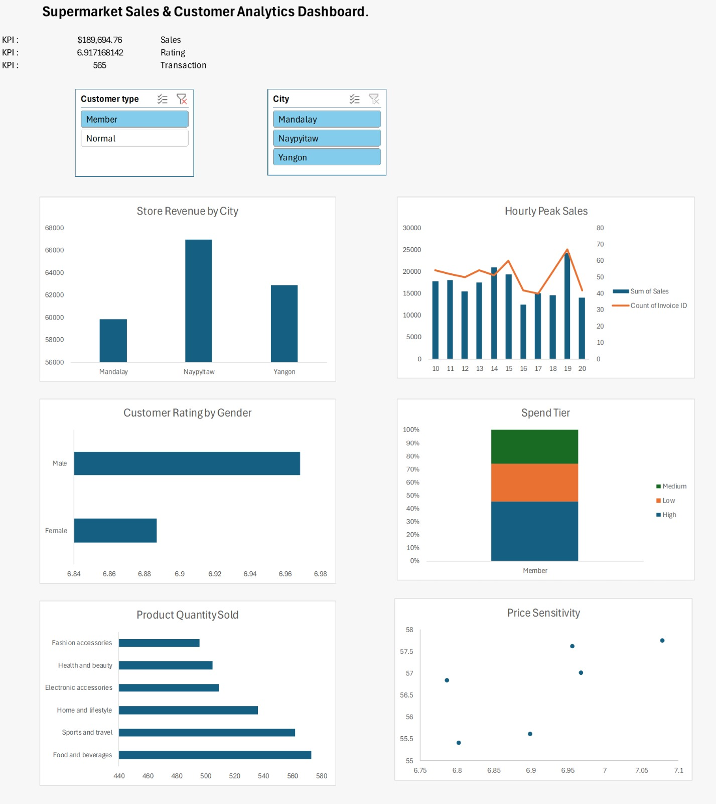

# 📊 Supermarket Sales & Customer Analytics Dashboard (Excel)

## 📌 Executive Summary
This interactive Excel dashboard analyzes transaction data across three store locations (Mandalay, Naypyitaw, Yangon) to evaluate overall revenue performance, customer purchasing behaviors, operational rush hours, and product category efficiency.

The goal is to equip retail store management with data-driven recommendations to optimize staffing schedules, marketing campaigns, and inventory distribution.

---

## 🖼️ Dashboard Preview

---

## 💡 Key Business Insights & Findings

1. **Store Location Revenue:**
   * **Insight:** Total sales are well-balanced across all three cities, generating ~$323K in combined revenue. Naypyitaw leads slightly in sales volume (~$110.5K).

2. **Customer Satisfaction Demographics:**
   * **Insight:** Both Male and Female customers give nearly identical average satisfaction ratings (~6.97 / 10), indicating product satisfaction is consistent across gender demographics.

3. **Product Inventory Volume:**
   * **Insight:** *Electronic accessories* (~971 units) and *Food and beverages* (~952 units) represent the highest physical unit sales volume.

4. **Operational Peak Hours (Staffing Optimization):**
   * **Insight:** Transaction volume and revenue peak sharply between **1:00 PM – 2:00 PM** and **7:00 PM – 8:00 PM**.
   * **Recommendation:** Increase cashier coverage during these rush windows to reduce checkout wait times.

5. **Customer Spending Tiers (Member vs. Normal):**
   * **Insight:** Loyalty Members account for a higher percentage of **High Spend Tiers (>$500)** compared to non-members.
   * **Recommendation:** Target mid-tier customers ($100–$500) with loyalty sign-up incentives at checkout.

6. **Product Line Efficiency & Price Sensitivity:**
   * **Insight:** *Sports and travel* carries a high average price (~$57.00) but suffers from below-average customer ratings (~6.91). *Food and beverages* achieves the highest overall rating (~7.11).

---

## 🛠️ Technical Excel Skills Demonstrated
* **Data Transformation:** `TIMEVALUE()`, `TEXT()`, and `HOUR()` logic for time-slot binning; nested `IF()` statements for categorical spend tiering.
* **Aggregations & Cross-Tabulations:** Multi-variable Pivot Tables, dynamic summary metrics, and percentage calculations.
* **Data Visualization:** Clustered Column Charts, 100% Stacked Column Charts, Scatter Plots with dynamic cell labels, and clean "chart junk" elimination.
* **Interactive Dashboard Architecture:** Slicer integration across multi-pivot caches using **Report Connections**, KPI summary scorecards, and hidden gridlines for clean UX.

---

## 📁 How to View the Project
1. Download the file [`SupermarketAnalysis.xlsx`](SupermarketAnalysis.xlsx).
2. Open in Microsoft Excel.
3. Interact with the **Branch** and **Customer Type** slicers on the `Dashboard` tab to filter metrics across the entire dataset.
